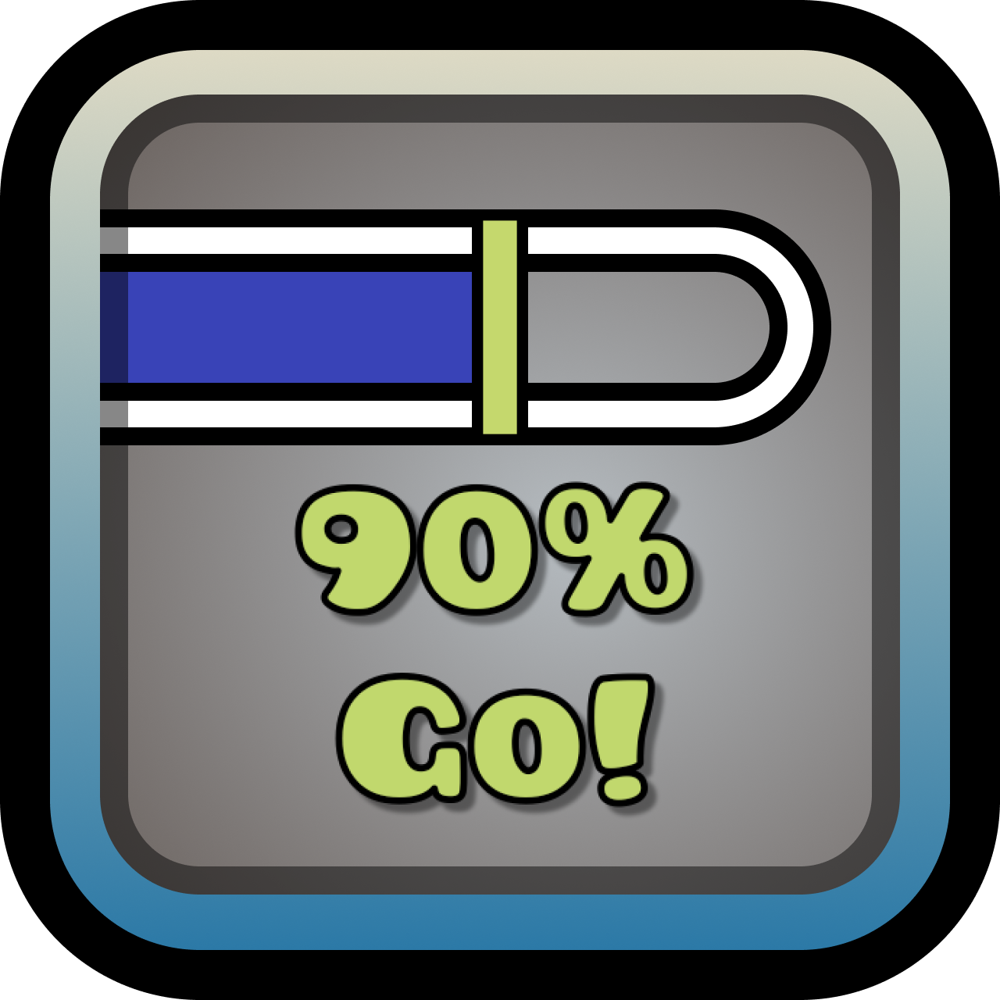

# Go! Indicators

This mod allows you to add custom indicators to your progress bar.
You can set percentage, color and text for each indicator.

Settings are stored separately for each level, so you can have different indicators for each one.

You can use `\n` to add newlines in the text.

## Help
If you have any questions, feel free to contact me on discord: `@prevter`,
or create an issue on the [GitHub page](https://github.com/prevter/gd-go-indicator).

## Credits
Idea by 7hat3eird0ne (Inspired by JonathanGD streams)

## License
This mod is licensed under the MIT License.